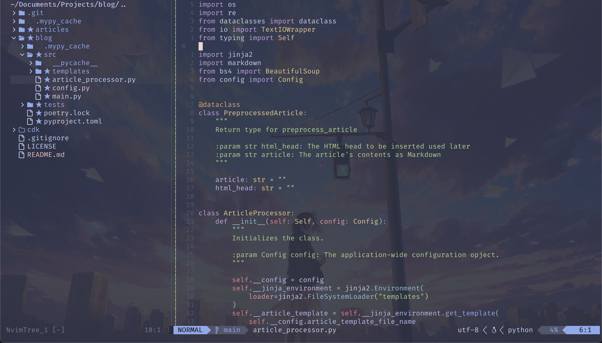

# nvim-config

This is my personal NeoVim config.

It includes essential plugins listed here and some personal preferences and niceties for macOS.

## Requirements

To use this config you will need Python and Node.js installed. Support is only guaranteed for the latest stable versions
of either.

## Usage

This config is designed for macOS with iTerm 2 and the Terminal.app compatible keymap. Furthermore, it is only tested
with [Zsh](https://www.zsh.org/) and [Oh My Zsh](https://ohmyz.sh/).

### **!! Disclaimers:**

- On macOS you'll need to run `ulimit -n 10240` to avoid getting a "too many open files" error prior to first installing
  this config

1. Clone this repository inside of `~/.config/nvim`
2. Configure it to your likings (see below)
3. Open nvim and run `:PackerSync`. This may fail, if it does repeat until it doesn't. If you get messages from
   TreeSitter or Mason let them finish.
4. It's possible that TreeSitter errors while compiling. Usually this can be ignored. If you're unsure if it all worked
   just check `:TSInstallInfo`
5. Enjoy :)

## Config

The configuration file can be found in `lua/config.lua`. Options inside the file are documented.

## Plugins

Way too many. Check `lua/plugins.lua`

## Other

- PyRight as Python LSP
- rust_analyzer as Rust LSP
- tsserver as TypeScript LSP
- isort for sorting Python imports
- Black for formatting Python code
- Prettier for formatting JS/TS/related
- hadolint for linting Dockerfiles
- markdownlint for linting Markdown files
- yamllint for linting YAML files
- rustfmt (has to be installed via rustup)
- ShellCheck for linting Shell scripts
- shfmt for formatting Shell scripts
